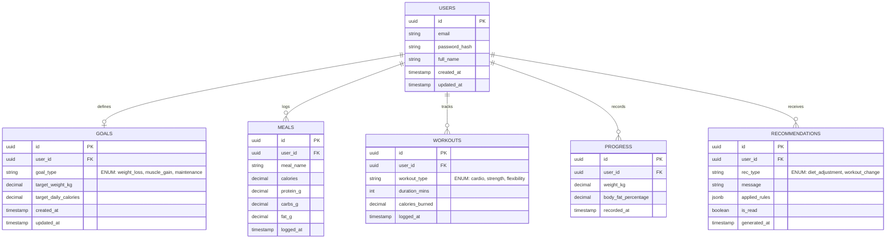

### 1. Overview
The database architecture for the ApexFit engine is designed to support a robust, backend-heavy fitness tracking and adaptive recommendation system. By leveraging a normalized relational structure, the database prioritizes data integrity, auditability, and efficient read/write operations for high-frequency transactional data (such as meals and workouts). The schema isolates core user authentication and profiling from the longitudinal tracking of biometric progress and algorithmic outputs. This separation of concerns enables the rule-based inference engine to rapidly aggregate trailing activity logs and progress data without locking the core user table, ensuring the system remains performant and scalable as historical datasets grow.

### 2. ER Diagram

### 3. Table Summary

| Table | Description |
| :--- | :--- |
| **USERS** | Stores core authentication capabilities and primary user identity data. |
| **GOALS** | Manages the primary objective for the user, maintaining the baseline targets needed for the recommendation engine (e.g., target weight, caloric targets). |
| **MEALS** | A high-volume transactional table capturing granular nutritional data including total calories and macronutrient splits (protein, carbs, fat). |
| **WORKOUTS** | Logs physical activity and energy expenditure, essential for dynamic caloric recalibrations by the rule engine. |
| **PROGRESS** | Tracks longitudinal biometric trends (e.g., body weight) to evaluate adherence and success against the defined user goal. |
| **RECOMMENDATIONS** | An immutable audit log of programmatic feedback dispensed by the adaptive engine, including the exact logic/thresholds that triggered the advice (stored as JSONB). |

### 4. Key Indexes

- **idx_users_email (Unique)**: Speeds up authentication lookups and prevents duplicate account registrations.
- **idx_meals_user_date**: A composite index on `(user_id, logged_at)` to optimize the engine's frequent queries for a user's trailing caloric intake.
- **idx_workouts_user_date**: A similar composite index on `(user_id, logged_at)` to rapidly calculate recent physical activity volume.
- **idx_progress_user_recorded**: Enhances longitudinal trend analysis queries, such as fetching a user's weight over the past month.
- **idx_recommendations_user_generated**: Optimizes the client application's ability to fetch the most recent, unread recommendations for the user dashboard.

### 5. Relationship Summary

- **One-to-One: USERS ↔ GOALS**
  - A user has a single active goal profile defining their targets. Separating this from the `USERS` table prevents schema bloat and maintains bounded contexts.
- **One-to-Many: USERS ↔ MEALS**
  - A single user records multiple meal entries over time.
- **One-to-Many: USERS ↔ WORKOUTS**
  - A single user tracks various workouts, aggregating into their total energy expenditure.
- **One-to-Many: USERS ↔ PROGRESS**
  - A user routinely adds new progress logs (like morning weigh-ins) creating a time-series dataset of biometrics.
- **One-to-Many: USERS ↔ RECOMMENDATIONS**
  - The inference engine continually generates new recommendations for the user based on anomalies or milestones detected in their aggregated data logs.
