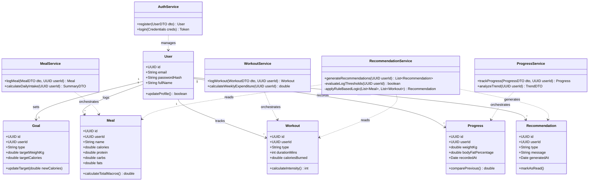

# ApexFit: Class Diagram

### 1. Overview
The ApexFit Class Diagram illustrates the object-oriented structure of the backend architecture. It establishes a clear separation of concerns between **Domain Models** (entities that map to database tables) and the **Service Layer** (classes that execute business logic). This design ensures the rule-based recommendation engine cleanly processes user data without coupling its behavioral logic directly into the stateful data models.

### 2. Class Diagram

### 3. Class Descriptions

#### Domain Models (Entities)
- **User**: Represents the primary actor in the system, maintaining securely hashed credentials and personal profile information.
- **Goal**: Encapsulates the user's current fitness objective (e.g., maintain weight) and establishes foundational target benchmarks for the application.
- **Meal**: A transactional entity logging daily food consumption, capturing total calories alongside precise macronutrient splits.
- **Workout**: Records distinct physical exercise sessions, defining duration and calculating total energy expenditure.
- **Progress**: Tracks periodic biometric weigh-ins and body stat updates to formulate a longitudinal dataset of the user's journey.
- **Recommendation**: An immutable output record generated by the systems rule-based engine, representing personalized programmatic advice.

#### Service Layer (Business Logic)
- **AuthService**: Handles foundational security operations, including credential hashing, session provisioning, and secure user registration.
- **MealService**: Validates nutritional inputs from the client, calculates macro breakdowns, and aggregates daily caloric intake against targets.
- **WorkoutService**: Processes physical activity entries and calculates trailing energy expenditure essential for algorithmic evaluations.
- **ProgressService**: Evaluates new biometric submissions against previous records to calculate progression deltas (e.g., weekly weight loss rate).
- **RecommendationService**: The core backend logic provider that extracts trailing data logs and applies deterministic behavioral algorithms to generate adaptive feedback.
