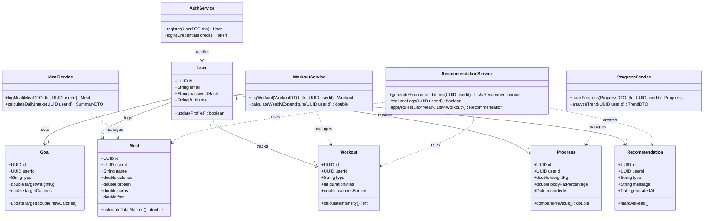

# ApexFit: Class Diagram

### 1. Overview

The ApexFit Class Diagram shows how the system is structured using different classes. It separates the data (models) from the logic (services), making the system easier to manage and understand. The recommendation system uses simple rules to process user data and give useful suggestions.

---

### 2. Class Diagram

---

### 3. Class Descriptions

#### Domain Models (Entities)

* **User**: Stores user details like email, password, and profile information.
* **Goal**: Stores the user’s fitness goal and target values.
* **Meal**: Stores daily food data like calories and nutrients.
* **Workout**: Stores exercise details and calories burned.
* **Progress**: Stores weight and body measurements over time.
* **Recommendation**: Stores suggestions generated by the system.

---

#### Service Layer (Business Logic)

* **AuthService**: Handles user login and registration.
* **MealService**: Handles meal logging and calculates daily intake.
* **WorkoutService**: Handles workout logging and calculates energy usage.
* **ProgressService**: Tracks progress and analyzes changes over time.
* **RecommendationService**: Uses user data and simple rules to generate suggestions.
