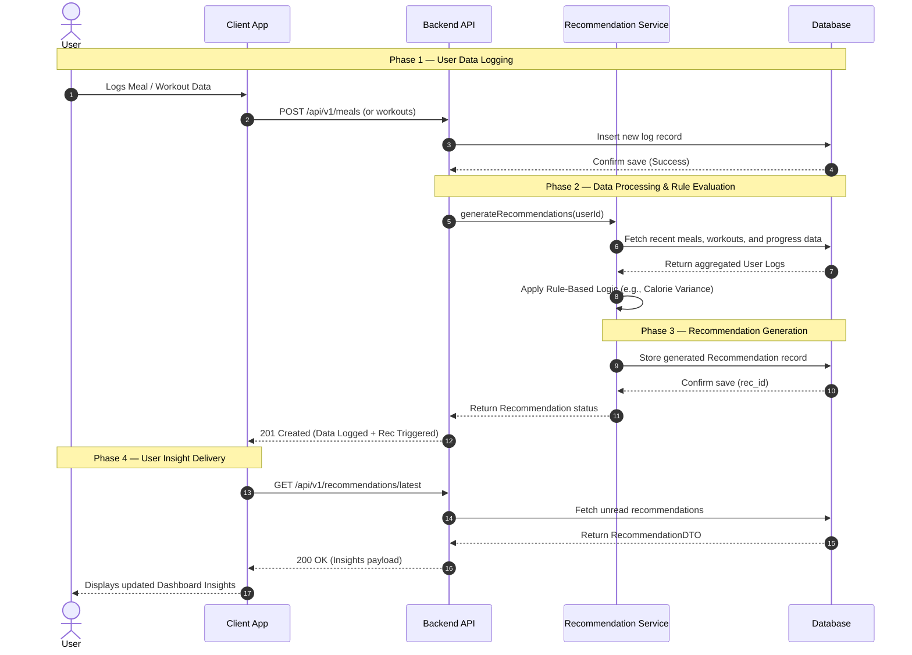

# ApexFit: Sequence Diagram

### 1. Overview
The ApexFit Sequence Diagram details the end-to-end flow of data when a user interacts with the system to log their fitness activities. It highlights the synchronous request cycle from the client application to the backend API, followed by an internal process where the Recommendation Service applies rule-based logic to generate actionable, personalized insights.

### 2. Sequence Diagram

### 3. Flow Summary Table

| Phase | Description | Key Patterns |
| :--- | :--- | :--- |
| **Phase 1 — User Data Logging** | The user inputs daily nutritional or physical activity data via the frontend interface, which the API strictly validates and saves. | Request-Response, CRUD Operations |
| **Phase 2 — Data Processing & Rule Evaluation** | The backend service retrieves historical data aggregates and applies rules to check user progress. | Data Aggregation, Rule-Based Processing |
| **Phase 3 — Recommendation Generation** | Tailored advice is generated based on the rules and saved in the database. | Internal Service Process, Persistence |
| **Phase 4 — User Insight Delivery** | The front end fetches the new recommendations and updates the dashboard for the user. | Client Retrieval, Data Presentation |
