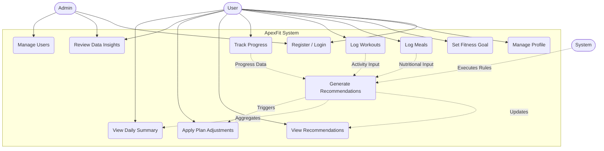

# ApexFit: Use Case Diagram

### 1. Overview
The ApexFit Use Case Diagram models the core interactions between users, administrators, and the backend tracking engine. It illustrates how daily data logging directly feeds into the system's rule-based logic to automatically generate and adjust personalized fitness directives.

### 2. Use Case Diagram

### 3. Use Case Description Table

| Use Case ID | Use Case Name | Actors | Description |
| :--- | :--- | :--- | :--- |
| **UC1** | Register / Login | User, Admin | Authenticates actors into the system using role-based access control. |
| **UC2** | Manage Profile | User | Allows users to update personal information and foundational biometric data. |
| **UC3** | Set Fitness Goal | User | Establishes the primary baseline objective (e.g., weight loss, muscle gain) for the rules engine. |
| **UC4** | Log Meals | User | Records daily nutritional intake to track against target caloric and macronutrient thresholds. |
| **UC5** | Log Workouts | User | Records physical activities to calculate daily energy expenditure. |
| **UC6** | Track Progress | User | Captures longitudinal biometric updates (e.g., body weight) to evaluate historical adherence. |
| **UC7** | View Recommendations | User | Displays programmatic nutritional and fitness advice generated by the backend rule engine. |
| **UC8** | Generate Recommendations | System | An automated background process evaluating trailing user logs against defined thresholds to create advice. |
| **UC9** | Apply Plan Adjustments | User, System | Recalibrates target caloric and macro baselines when the engine detects progress stagnation. |
| **UC10** | Review Data Insights | User, Admin | Provides aggregated summaries of longitudinal adherence, system usage, and demographic performance. |
| **UC11** | Manage Users | Admin | Allows administrators to audit system activity, resolve issues, and oversee platform configurations. |
| **UC12** | View Daily Summary | User | Presents a unified daily snapshot of logged metrics and system-generated advice statuses. |
